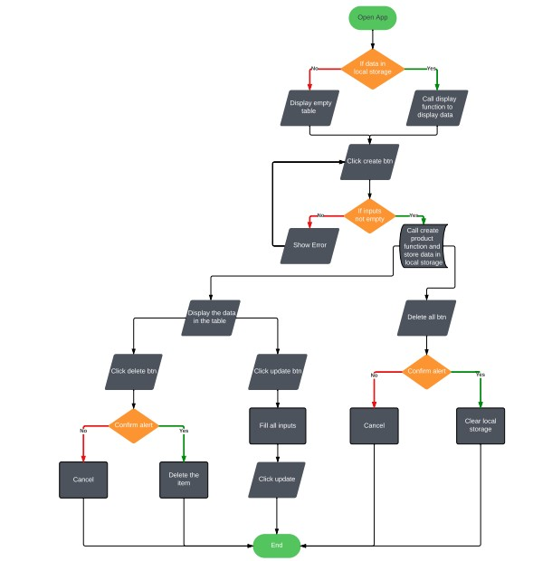

# Alx Capstone Project

## Project Overview:

- The product management application is an application that helps manage and store products, classifies them into categories, and makes you able to add new products, modify existing products, and delete products.

## Features and Functionality:

- Create Prouduct
- Edit Prouduct
- Delete Prouduct
- Delete All Products
- Search Product

## Technologies Used:

- HTML & CSS for Frontend
- JavaScript for interacting and logic
- local Storage

## Live Demo:

- [➥ Live Demo](#)

## Contact:

** Fager Mohsen Fager Saeed:
- [Linkedin](https://www.linkedin.com/in/fager-saeed-25a923296/)
- [Gmail](mailto:fageern@gmail.com)

## Work Flow:

